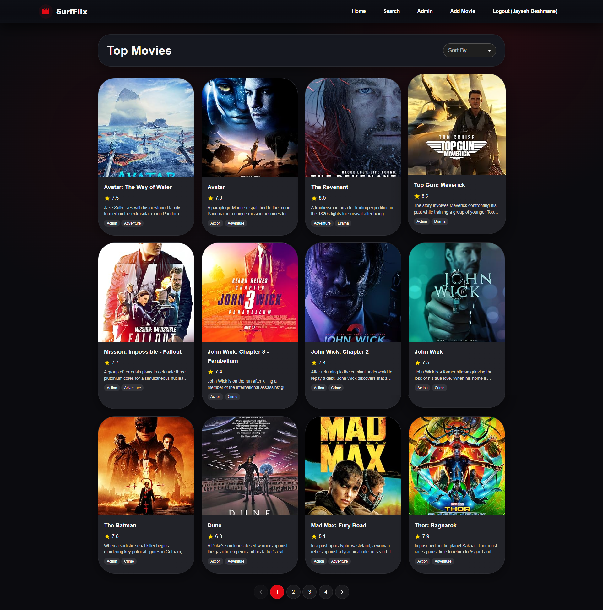
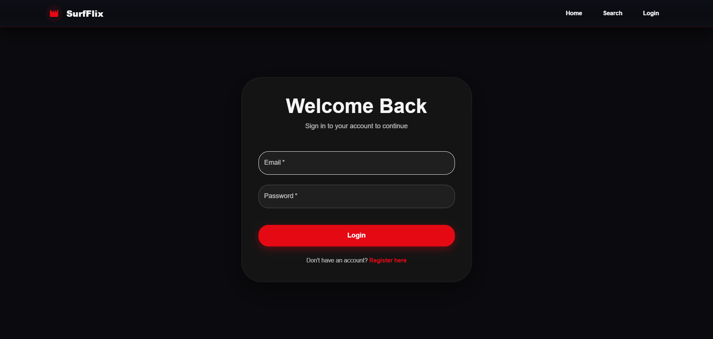
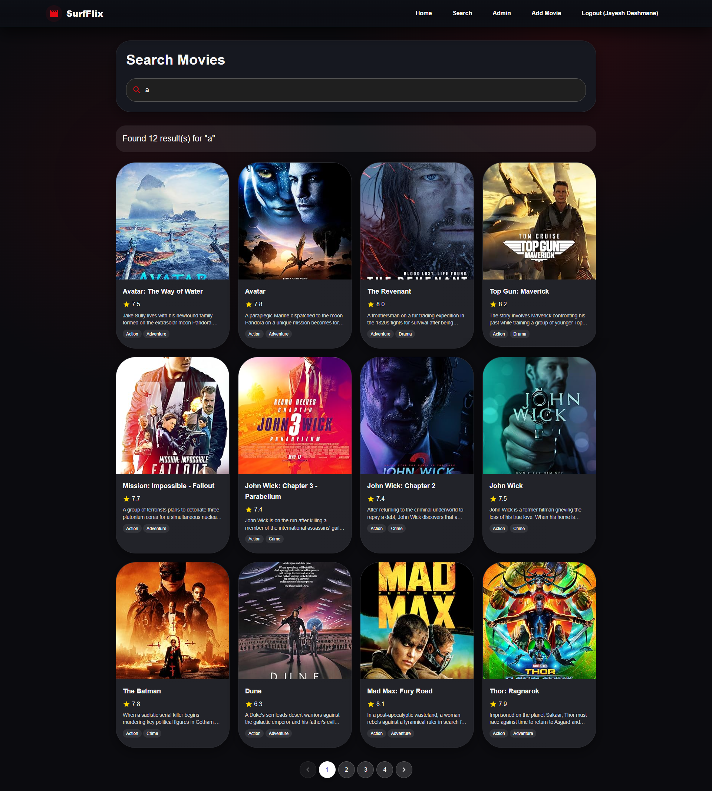
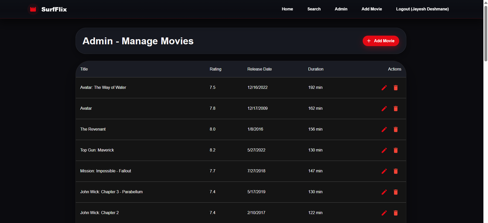

# 🎬 SurfFlix - MERN Movie Management App
[🔴🔴LIVE](https://movie-mern-project.vercel.app/)

A full-stack Movie Management Platform built using the MERN stack that allows users to browse, search, and view movies, while admins can securely manage movie data with full CRUD operations.
---

## 🚀 Features

### 👤 User Features
- 🏠 **Home Page**: View all movies with pagination
- 🔍 **Search Movies**: Search movies by title or description
- 📄 **Movie Details**: View complete movie information (rating, genre, cast, poster, etc.)
- ⭐ **Ratings Display**: Visual rating system (IMDb-style)

### 🛠 Admin Features
- ➕ **Add Movie**: Admin-only movie creation
- ✏️ **Edit Movie**: Update movie details
- 🗑️ **Delete Movie**: Remove movies from the database
- 🔐 **Protected Routes**: Admin routes secured using role-based access

### 🔐 Authentication & Security
- 🔑 **JWT Authentication**
- 🧑‍💼 **Role-Based Authorization (Admin/User)**
- 🚫 **Secure API access using middleware**

---

## 🧰 Tech Stack

| Layer | Technology |
|-------|------------|
| Frontend | React.js, React Router DOM, Axios, Material-UI (MUI) |
| Backend | Node.js, Express.js |
| Database | MongoDB |
| Authentication | JWT |
| Deployment | Vercel / Render / MongoDB Atlas |

---

## 📁 Project Structure

```
Movie_Mern_Project/
├── backend/
│   ├── controllers/          # Business logic
│   ├── models/               # Mongoose schemas
│   ├── routes/               # API routes
│   ├── middleware/           # Auth & error handling
│   ├── utils/                # JWT & helpers
│   ├── seedMovies.js         # Seeder script
│   └── server.js             # Entry point
│
├── frontend/
│   ├── src/
│   │   ├── components/       # Reusable UI components
│   │   ├── pages/            # App pages
│   │   ├── context/          # Auth Context
│   │   ├── config/           # API calls
│   │   └── App.jsx           # Routing & layout
│   └── vite.config.js
│
├── images/                   # App screenshots
├── .env                      # Environment variables
└── README.md

```
---

## 🔑 Environment Variables

Create a `.env` file in both **frontend** and **backend** folders.

### Backend `.env`
```
PORT=5000
MONGO_URI=your_mongo_connection_string
JWT_SECRET=your_jwt_token_secret
OMDB_API_KEY=your_omdb_api_key
```

### Frontend `.env`

```
VITE_API_URL=http://localhost:5000

```

---

## 🌱 Seeder

Populate the database using OMDb API:
```
node seedMovies.js

```
## ⚙️ Installation & Setup

### 1️⃣ Clone the Repository
```sh
git clone https://github.com/Jayeshdeshmane28/Movie_Mern_Project.git
cd Movie_mern_project
```

### 2️⃣ Install Dependencies

Backend

```
cd backend
npm install
npm run dev
```

Frontend

```
cd ../frontend
npm install
npm run dev
```

▶️ Running the Application
Service	Command	URL
Backend	
```
npm run dev	http://localhost:5000
```

Frontend	
```
npm run dev	http://localhost:3000
 (or Vite port)
```

## Screenshots

<table>
  <tr>
    <td><b>Home Page</b></td>
    <td><b>Login Page</b></td>
  </tr>
  <tr>
    <td></td>
    <td></td>
  </tr>
  <tr>
    <td><b>Search Page</b></td>
    <td><b>Add Movie (Admin)</b></td>
  </tr>
  <tr>
    <td></td>
    <td></td>
  </tr>
  <tr>
    <td colspan="2"><b>Admin Movie Management</b></td>
  </tr>
  <tr>
    <td colspan="2" align="center">
      
    </td>
  </tr>
</table>


## Built with ❤️ using React, Node.js, Express, and MongoDB

## Contact

For questions or feedback, mail at deshmanejayesh99@gmail.com
